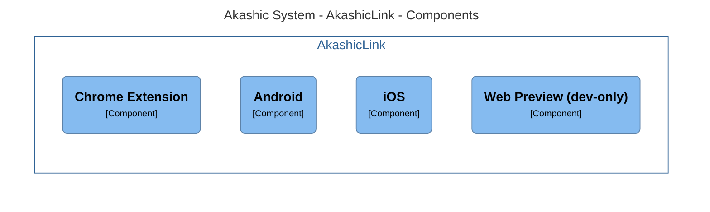

# AkashicLink

> Mobile apps + Chrome extension

### Wallet Container Diagram



## Warnings

- Chrome extension does not support page reloads - whenever added a reload, perform a platform check as so:

```ts
import { isPlatform } from '@ionic/react';
...
isPlatform('mobile') && location.reload();
```

## Installation

1. Install all packages and setup .env file

```sh
cp .env.example .env # optionally edit .env to suit your needs
cp .env.example .env.staging.local # If you need to build Android App. Copy as .env.production.local for production env
yarn install
```

## Running locally as Web

1. Start backend in `app/backend`
2. Run

```sh
yarn start:dev
```

3. You can use the following at root of the monorepo to start all at once

```sh
yarn start:all
```

## Running locally as Chrome extension

1. Build the extension by first building the full app (it moves the `manifest.json` file to the correct location), and then run the dev build

```sh
yarn build
yarn build:dev
```

2. Go to `browser://extensions/` and activate **Developer Mode**.

3. Click **Load unpacked** and select the `build` folder. Extension should appear in browser.

4. Source file updates will take around 5-6 seconds to recompile. [See here](https://developer.chrome.com/docs/extensions/mv3/getstarted/development-basics/#reload) for information of when the extensions needs reloading.

## Building Chrome extension for production

1. Set the `.env` with

```text
REACT_APP_PUBLIC_URL=https://api.akashicpay.com
REACT_APP_API_BASE_URL=https://api.akashicpay.com/api/v0
```

2. Build extension

```shell
yarn build
```

3. Zip the `build` folder

## Running locally as Android App

1. Install Android Studio, SDK v33 and virtual devices as instructed in [Ionic Doc](https://ionicframework.com/docs/v6/developing/android)
2. Build the App with

```sh
yarn sync:android
```

3. Open the App automatically with

```shell
yarn serve:android
```

4. In Android Studio, click "Run" to run the app in virtual device

## Live reloading Android or ios App

add IS_LIVE_RELOAD=true in `.env.staging.local`

```sh
yarn debug:ios
```

or

```sh
yarn debug:android
```

## Styling

> Styling is done with `scss` and 80% of what you would need to use can be found [in this tutorial](https://sass-lang.com/guide/#variables).

Any global styles, should be defined in the [theme](./src/theme/) folder and imported in [common.scss](./src/theme/common.scss) as so

```scss
@use "typography";
@use "layout";
@use "ion-popover";
```

For styling individual components, create a `file-of-same-name.scss` next to your `.tsx` file and target specific components adding `className` in the html:

```html
<IonLabel className="my-class-1"></IonLabel>
```

or

```html
<IonSelect interfaceOptions={{ htmlAttributes: { className: 'my-class-2'}}}>
```

Then use [selectors, specificity and inheritance](https://developer.mozilla.org/en-US/docs/Learn/CSS/Building_blocks/Cascade_and_inheritance) in the `.scss` file to target these components and their direct and indirect children:

- `.class1 .class2` (for when class2 is a descendant of a class1 element)
- `.class1.class2` (when an element is both class1 and class2)
- `+`, `>` and other combinators to target direct children, sibling and adjacent components (see [here](https://developer.mozilla.org/en-US/docs/Learn/CSS/Building_blocks/Selectors/Combinators))

Example below will apply the styles to any `<IonSelect>` and `<IonList>` that are descendants of a component with class `my-custom-class-2` but not across the whole application.

```scss
.my-class-2 {
  /**
   * Add a frame to the selection menu and round the corners
   */
  ion-select-popover {
    border: 1px solid var(--ion-select-border) !important;
    border-radius: 4px;
  }

  /*
   * Ensures that selection menu is small enough to fit
   * under the selection button
   */
  ion-list {
    padding-top: 0px;
    padding-bottom: 0px;
    border-radius: 3px;
    max-height: 120px;
    overflow: scroll;
  }
}
```

## Images

All UI images should be put in the global [shared assets folder](../../static/assets/).
They will be automatically synced into the local [shared assets folders](./public//shared-assets/)
making them available throughout the monorepo.

## Craco

We are using create-react-app to manage all of the transpiling needed for the different `.css`, `.html`, `.tsx` files (under the hood it uses `webpack`). While it generally does a good job, we sometimes need to fine tune by overriding the config with `craco` to:

- Process files outside the root directory. Specifically, instruct how to transpile `.ts` files in the sister packages inside the monorepo
- Turn off optimisation when developing locally
- Fix conflicts in the react version

## Storybook

<details>
<summary>Open for instructions</summary>
 
1. Create your stories in the `./storybook/stories/` folder using the following template:

```tsx
import type { Meta, StoryObj } from "@storybook/react";

import { YOURCOMPONENT } from "../../src/YOUR-FOLDER";

const meta: Meta<typeof BackButton> = {
  title: "SUBTREENAME",
  component: YOURCOMPONENT,
};
export default meta;
type Story = StoryObj<typeof YOURCOMPONENT>;

export const Story1: Story = {};
export const Story2: Story = {};
export const Story3: Story = {};
```

2. To customise the mock requests for each story, add a mock service worker (to either the meta or the individual stories)

```ts
export const Story1: Story = {
  parameters: {
    msw: {
      handlers: {
        GROUPNAME: [MOCK_REST_IMPLEMENTATIONg],
      },
    },
  },
};
```

3. To customise the context that a component receives, specify the context e.g.

```ts
import { LocalAccountContext } from '../../src/components/PreferenceProvider';

export const Story1: Story = {
  decorators: [
    withReactContext({
      Context: IMPORT_CONTEXT_FROM ../../src/components/PreferenceProvide,r
      initialState: {
        localAccounts: [{
          identity: "mock-identity",
          username: "mock-username"
        }]
      },
    })
  ],
};
```

4. To customise the path that the component is placed on, use the `withMockPath` decorator. Normally you would apply this to the `meta` object

```ts
import { akashicPayPath } from "../../src/routing/navigation-tabs";
import { urls } from "../../src/constants/urls";
import { withMockPath } from "../utils/mock-path";

const meta: Meta<typeof DashboardComponent> = {
  title: "Pages",
  component: DashboardComponent,
  decorators: [withMockPath(akashicPayPath(urls.loggedFunction))],
};
```

</details>
